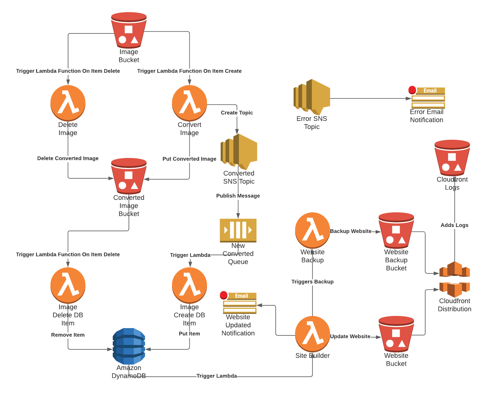

# Greyscale
Proof of concept application for automating image processing and content delivery to static html using AWS Lambda



## Install
Note the ARN for every resource created.

### S3
Create 4 S3 Buckets 
- greyscale
- greyscale-convert
- greyscale-website
- greyscale-website-backup 
For `greyscale-convert`, `greyscale-website`, `greyscale-website-backup` set permissions `block all public access` to `off` and add the following Bucket Policy: 
```
{
    "Version": "2012-10-17",
    "Statement": [
        {
            "Effect": "Allow",
            "Principal": "*",
            "Action": "s3:GetObject",
            "Resource": "arn:aws:s3:::{{bucket-name}}/*"
        }
    ]
}
```
### SNS 
Create 3 `standard` topics 
- ErrorTopic
- ImageTopic
- WebsiteUpdated

### SQS
Create 1 queue
- ImageQueue

### DynamoDB
Create 1 Table
- Image

### IAM
Create the following policies and attach them to a corrisponding role
- greyscale-db-delete-lambda
```
{
    "Version": "2012-10-17",
    "Statement": [
        {
            "Effect": "Allow",
            "Action": [
                "s3:PutObject",
                "s3:GetObject",
                "logs:CreateLogStream",
                "sns:Publish",
                "dynamodb:DeleteItem",
                "dynamodb:Scan",
                "s3:DeleteObject",
                "logs:CreateLogGroup",
                "logs:PutLogEvents"
            ],
            "Resource": [
                "arn:aws:dynamodb:{{table}}",
                "arn:aws:logs:*:*:*",
                "arn:aws:s3:::greyscale-convert/*",
                "arn:aws:sns:{{region:id}}:ErrorTopic"
            ]
        }
    ]
}
```
- greyscale-create-func-lambda
```
{
    "Version": "2012-10-17",
    "Statement": [
        {
            "Effect": "Allow",
            "Action": [
                "logs:PutLogEvents",
                "logs:CreateLogGroup",
                "logs:CreateLogStream"
            ],
            "Resource": "arn:aws:logs:*:*:*"
        },
        {
            "Effect": "Allow",
            "Action": [
                "s3:GetObject"
            ],
            "Resource": "arn:aws:s3:::greyscale/*"
        },
        {
            "Effect": "Allow",
            "Action": [
                "s3:PutObject",
                "s3:DeleteObject"
            ],
            "Resource": "arn:aws:s3:::greyscale-convert/*"
        },
        {
            "Effect": "Allow",
            "Action": [
                "s3:PutObject"
            ],
            "Resource": "arn:aws:s3:::greyscale-website/*"
        },
        {
            "Effect": "Allow",
            "Action": [
                "sns:Publish"
            ],
            "Resource": "arn:aws:sns:{{region:id}}:ImageTopic"
        },
        {
            "Effect": "Allow",
            "Action": [
                "sns:Publish"
            ],
            "Resource": "arn:aws:sns:{{region:id}}:ErrorTopic"
        }
    ]
}
```
- greyscale-db-create-lambda
```
{
    "Version": "2012-10-17",
    "Statement": [
        {
            "Effect": "Allow",
            "Action": [
                "sqs:ReceiveMessage",
                "sqs:GetQueueAttributes",
                "sqs:DeleteMessage",
                "logs:CreateLogStream",
                "sns:Publish",
                "dynamodb:PutItem",
                "dynamodb:Scan",
                "logs:CreateLogGroup",
                "logs:PutLogEvents"
            ],
            "Resource": [
                "arn:aws:dynamodb:{{region:id}}:table/Image",
                "arn:aws:logs:*:*:*",
                "arn:aws:sns:{{region:id}}:ErrorTopic",
                "arn:aws:sqs:{{region:id}}:ImageQueue"
            ]
        }
    ]
}
```
- greyscale-site-builder-lambda
```
{
    "Version": "2012-10-17",
    "Statement": [
        {
            "Effect": "Allow",
            "Action": [
                "dynamodb:GetShardIterator",
                "dynamodb:GetItem",
                "dynamodb:Scan",
                "dynamodb:DescribeStream",
                "dynamodb:GetRecords"
            ],
            "Resource": "arn:aws:dynamodb:{{region:id}}:table/Image"
        },
        {
            "Effect": "Allow",
            "Action": "lambda:InvokeFunction",
            "Resource": "*"
        },
        {
            "Effect": "Allow",
            "Action": [
                "s3:PutObject",
                "logs:CreateLogStream",
                "sns:Publish",
                "dynamodb:GetShardIterator",
                "dynamodb:GetItem",
                "dynamodb:Scan",
                "dynamodb:DescribeStream",
                "logs:CreateLogGroup",
                "logs:PutLogEvents",
                "dynamodb:GetRecords"
            ],
            "Resource": [
                "arn:aws:s3:::greyscale-website/*",
                "arn:aws:logs:*:*:*",
                "arn:aws:sns:{{region:id}}:ErrorTopic",
                "arn:aws:dynamodb:{{region:id}}:table/Image",
                "arn:aws:dynamodb:{{region:id}}:table/Image/stream/*",
                "arn:aws:sns:{{region:id}}:websiteUpdated"
            ]
        },
        {
            "Effect": "Allow",
            "Action": "dynamodb:ListStreams",
            "Resource": [
                "arn:aws:dynamodb:{{region:id}}:table/Image",
                "arn:aws:dynamodb:{{region:id}}:table/*"
            ]
        }
    ]
}
```
- greyscale-db-delete-lambda
```
{
    "Version": "2012-10-17",
    "Statement": [
        {
            "Effect": "Allow",
            "Action": [
                "s3:PutObject",
                "s3:GetObject",
                "logs:CreateLogStream",
                "sns:Publish",
                "dynamodb:DeleteItem",
                "dynamodb:Scan",
                "s3:DeleteObject",
                "logs:CreateLogGroup",
                "logs:PutLogEvents"
            ],
            "Resource": [
                "arn:aws:dynamodb:{{region:id}}:table/Image",
                "arn:aws:logs:*:*:*",
                "arn:aws:s3:::greyscale-convert/*",
                "arn:aws:sns:{{region:id}}:ErrorTopic"
            ]
        }
    ]
}
```
- greuscale-backup-lambda
```
{
    "Version": "2012-10-17",
    "Statement": [
        {
            "Effect": "Allow",
            "Action": [
                "logs:PutLogEvents",
                "logs:CreateLogGroup",
                "logs:CreateLogStream"
            ],
            "Resource": "arn:aws:logs:*:*:*"
        },
        {
            "Effect": "Allow",
            "Action": [
                "s3:PutObject"
            ],
            "Resource": "arn:aws:s3:::greyscale-website-backup/*"
        },
        {
            "Effect": "Allow",
            "Action": [
                "s3:GetObject"
            ],
            "Resource": "arn:aws:s3:::greyscale-website/*"
        }
    ]
}
```

### Lambda
In every lambda there is a `Makefile`, update the `create` target with the correct IAM ARN Role created above.

#### Create The Lambda Functions
In each lambda directory, run:
```
$ make create
```

### Cloudfront
Create a cloudfront distribution and point the `website` bucket as an origin with `index.html` as a target. 


### Usage
Add an image to the greyscale bucket to trigger the lambda events.  
